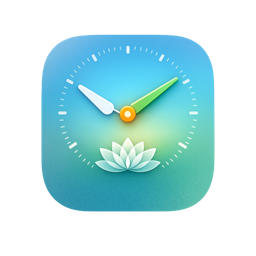

<p align="center">
  
</p>

# Present

A simple, intentional way to track time on macOS. Present combines a menu bar
timer with a full windowed app and a CLI tool, all backed by a local SQLite
database.

[](https://github.com/terriann/present/actions/workflows/ci.yml)

## Table of Contents

- [Features](#features)
- [Requirements](#requirements)
- [Installation](#installation)
  - [Download (Recommended)](#download-recommended)
  - [From Source](#from-source)
- [Quick Start](#quick-start)
- [CLI Usage](#cli-usage)
- [Architecture](#architecture)
- [Project Structure](#project-structure)
- [Development](#development)
- [Contributing](#contributing)
- [License](#license)

## Features

| Feature | Description | Issues |
|---|---|---|
| **Menu bar timer** | Start, pause, and stop sessions from the menu bar. See elapsed or remaining time at a glance. | [View](https://github.com/terriann/present/issues?q=label%3Afeature%2Fmenu-bar) |
| **Sessions** | Work (open-ended), Rhythm (Pomodoro-style cycles with breaks), and Timebound (fixed countdown). | [View](https://github.com/terriann/present/issues?q=label%3Afeature%2Fsessions) |
| **Activities** | Track what you're working on with external IDs to link to tools like Jira, Linear, and GitHub Issues. | [View](https://github.com/terriann/present/issues?q=label%3Afeature%2Factivities) |
| **Tags** | Organize activities with tags for flexible grouping and filtering. | [View](https://github.com/terriann/present/issues?q=label%3Afeature%2Ftags) |
| **Dashboard** | Today's summary, current session display, and activity breakdown. | [View](https://github.com/terriann/present/issues?q=label%3Afeature%2Fdashboard) |
| **Reports** | Daily, weekly, and monthly summaries with bar and pie charts. Export to CSV. | [View](https://github.com/terriann/present/issues?q=label%3Afeature%2Freports) |
| **CLI tool** | Full control from the terminal. Start sessions, manage activities, and view reports. Everything the app can do. | [View](https://github.com/terriann/present/issues?q=label%3Afeature%2Fcli) |
| **Notifications** | Gentle alerts when timers complete and break suggestions after rhythm sessions. | [View](https://github.com/terriann/present/issues?q=label%3Afeature%2Fnotifications) |
| **Timeboxing** | Plan blocks of time for activities with a specific start and end. | [View](https://github.com/terriann/present/issues?q=label%3Afeature%2Ftimeboxing) |

All data is stored locally in SQLite via [GRDB](https://github.com/groue/GRDB.swift). No accounts, no cloud sync.

## Requirements

- macOS 15 (Sequoia) or later
- Xcode 16+ (for building from source)

## Installation

### Download (Recommended)

Go to the [GitHub Releases](https://github.com/terriann/present/releases)
page and download the latest `Present.dmg`. Open it and drag Present to your
Applications folder. The CLI binary (`present-cli`) is included in the DMG
alongside the app.

Requires macOS 15 (Sequoia) or later.

### From Source

```bash
git clone https://github.com/terriann/present.git
cd present

# Build and run the CLI
swift build
.build/debug/present-cli --help

# Generate Xcode project and build the app
brew install xcodegen  # if not installed
xcodegen generate
open Present.xcodeproj
```

## Quick Start

Once the app is running, you can start tracking time immediately:

1. **From the menu bar:** Click the Present icon, select an activity (or
   create one), and start a session.
2. **From the CLI:** Run `present-cli session start "My Task"` to begin a work
   session. The activity is created automatically if it does not exist.
3. **View your day:** Open the main window for a dashboard summary, or run
   `present-cli report today -f text` in the terminal.

## CLI Usage

All commands follow `present-cli <noun> <verb>`. Output defaults to JSON for
scripting; use `-f text` for human-readable output.

```text
present-cli session status            # Current session as JSON (default command)
present-cli session start "Task"      # Start a work session (creates activity if needed)
present-cli session start "Task" --type rhythm --minutes 25
present-cli session stop              # Stop the current session
present-cli session pause             # Pause / resume
present-cli session resume
present-cli session cancel            # Cancel without logging
present-cli activity list             # List activities
present-cli activity note "Some text" # Append note to current activity
present-cli report today -f text       # Today's summary, human-readable
present-cli report export --from 2026-02-01 --to 2026-02-15  # Export CSV
present-cli session status --field state  # Extract a single value: "running"
```

**Command groups:** [`session`](docs/cli-reference.md#present-cli-session) |
[`activity`](docs/cli-reference.md#present-cli-activity) |
[`tag`](docs/cli-reference.md#present-cli-tag) |
[`report`](docs/cli-reference.md#present-cli-report) |
[`config`](docs/cli-reference.md#present-cli-config)

Session types: `work` (default), `rhythm`, `timebound`.

Run `present-cli --help` or `present-cli <noun> --help` for full option
details. See the [CLI Reference](docs/cli-reference.md) for complete
documentation.

The CLI shares the same SQLite database as the app. Changes made in the CLI
are reflected in the app (and vice versa) via IPC notifications and database
polling.

## Architecture

```text
SwiftUI Views -> @Observable ViewModels -> PresentAPI Protocol -> PresentService -> GRDB/SQLite
                                                  ^
CLI Commands ─────────────────────────────────────┘
```

Both the app and CLI consume the same `PresentAPI` protocol, which
guarantees feature parity. Key architectural decisions:

- **Swift 6** with strict concurrency checking enabled.
- **GRDB** for SQLite with WAL mode, enabling concurrent reads and writes
  between the app and CLI.
- **`@Observable`** (Observation framework) for SwiftUI view models instead
  of the older `ObservableObject`/`@Published` pattern.
- **Swift Testing** framework for all test suites (not XCTest).
- **XcodeGen** generates the Xcode project from `project.yml`. The generated
  `.xcodeproj` is gitignored.
- **Unix domain socket IPC** allows the CLI to notify the running app of
  data changes in real time.

See [plans/v1-spec.md](plans/v1-spec.md) for the full specification.

## Project Structure

```text
present/
├── Sources/
│   ├── PresentCore/            # Shared library (models, API, database, IPC)
│   │   ├── API/                # PresentAPI protocol, PresentService, DTOs
│   │   ├── Database/           # DatabaseManager, migrations, schema
│   │   ├── IPC/                # Unix domain socket server/client
│   │   ├── Models/             # GRDB record types (Activity, Session, Tag, etc.)
│   │   └── Utilities/          # Time formatting, CSV export, constants
│   └── PresentCLI/             # CLI executable (swift-argument-parser)
│       └── Commands/           # One file per CLI command
├── PresentApp/                 # macOS app (SwiftUI, not an SPM target)
│   ├── ViewModels/             # AppState (@Observable)
│   ├── MenuBar/                # Menu bar popover and session controls
│   ├── Views/                  # Dashboard, Log, Reports, Activities, Settings
│   │   └── Shared/             # Reusable components (MarkdownEditor, etc.)
│   └── Notifications/          # System notification manager
├── Tests/
│   ├── PresentCoreTests/       # Service, IPC, model, and database tests
│   └── PresentCLITests/        # CLI workflow and integration tests
├── Scripts/                    # Build, notarize, and install scripts
├── plans/                      # Specification documents
├── Package.swift               # SPM manifest (PresentCore + PresentCLI)
└── project.yml                 # XcodeGen project definition
```

## Development

See [DEVELOPMENT.md](DEVELOPMENT.md) for setup instructions, building,
testing, and contributor workflows.

The project has 68 tests across 5 test suites (in 2 test targets) covering
the service layer, IPC, models, database, and CLI workflows. All tests use
in-memory SQLite databases for fast, isolated execution.

```bash
swift test   # Run all tests
```

## Contributing

1. Fork the repository and create a feature branch.
2. Run `xcodegen generate` after cloning or pulling changes.
3. Make your changes and verify all tests pass with `swift test`.
4. Open a pull request against `main`.

To file a bug report or feature request, use the `/issue` slash command in
Claude Code. This ensures your issue includes relevant codebase context,
architectural details, and a well-researched description.

See [DEVELOPMENT.md](DEVELOPMENT.md) for detailed setup and coding
conventions.

## License

All rights reserved.
